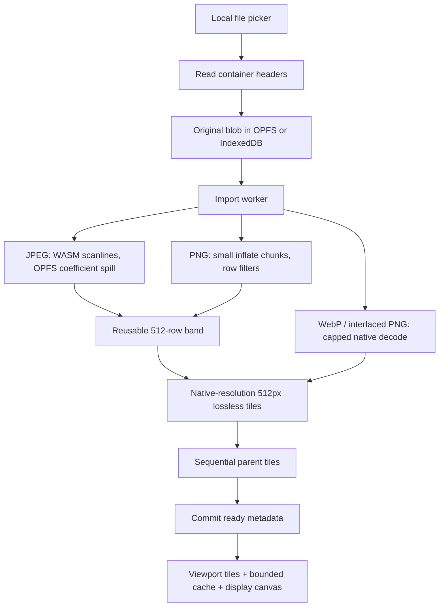

# Image pipeline and memory ownership

The crucial distinction is between compressed file size and decoded pixels. A 9,000² RGBA image is 324,000,000 bytes (~309 MiB) before any extra canvas, GPU, or temporary encoder buffers. Moving this decode to a worker alone would not fix the memory problem. `createImageBitmap(blob, crop…)` offers cropping but no portable guarantee that decoding the original has a bounded memory footprint.

## JPEG

`native/jpeg.c` supplies libjpeg a 64 KiB input buffer. Its synchronous callback reads the original through an OPFS sync access handle in the worker. The compressed original is not copied into WASM. Each decoded RGBA scanline is immediately copied into the band before the decoder reuses its buffer.

Baseline JPEG needs row/MCU buffers. Progressive JPEG requires random access to large coefficient arrays. `native/jmemopfs.c` implements libjpeg's backing-store interface over preopened worker OPFS scratch handles. Its memory manager targets 12 MiB; remaining coefficients spill to disk. Reads/writes use offsets, no SharedArrayBuffer, cross-origin isolation, asynchronous suspension, or platform-specific native plugin. All input/scratch handles close in a `finally` block and scratch files are removed. The import worker is terminated after completion/cancellation to release its WASM instance.

The codec build uses 32 MiB initial linear memory and a 96 MiB ceiling. This bounds the decoder heap, not the entire process. Worker JavaScript, scanline band, canvases, native encoders and browser overhead have separate allocations. The WASM memory manager cannot roll back browser process termination, so unfinished imports are also recoverable through metadata.

In the IndexedDB fallback a bounded-size compressed JPEG is copied into JavaScript memory; pixels still decode as rows. Large progressive JPEG is explicitly rejected when coefficient backing files cannot be supplied. OPFS selection verifies writes rather than relying only on the existence of an API.

## PNG

Container parsing records IDAT byte ranges without loading their contents. A backpressured readable stream passes at most 4 KiB compressed input per pull into native `DecompressionStream('deflate')`. This is deliberately small: [WebKit buffers each input chunk's inflated output](https://docs.webkit.org/Deep%20Dive/Modules/CompressionStreams.html). Passing an entire large IDAT chunk could inflate hundreds of MiB at once.

The decoder retains two unfiltered rows and one RGBA row. It supports non-interlaced grayscale, RGB, indexed palette, gray-alpha, and RGBA; 1/2/4-bit samples where legal; 8/16-bit channels and tRNS. It converts to RGBA8. Deflate's integrity check and exact pixel-stream length are checked; individual PNG chunk CRCs are not currently validated. Embedded color profiles/gamma are not applied. Interlaced PNG is detected before pixels are consumed and uses the same size-limited native fallback as WebP.

## Tiles and levels

A full-width 512-row band is reused. For 9k: 17.6 MiB; for 15k: 29.3 MiB. One reusable 512² ImageData object supplies cropped edge tiles to a small OffscreenCanvas. Lossless PNG is used so the native-resolution representation introduces no additional JPEG artifacts. As a result, photographic originals can expand considerably on disk.

The level dimensions are `ceil(original / 2^level)`. Each parent is assembled from up to four sequentially decoded child tiles into a ≤512² canvas; each child closes immediately after drawing. No complete intermediate resolution is ever materialized. Rounded final edges are clipped to the original extent in the viewer. A 9k square has 444 tiles across six levels; a 15k square has 1,210 tiles across six levels.

## Viewer

The camera is in original-image coordinates, with a rotation angle, scale and screen translation. Pointer movement changes translation. Pinch, wheel and double-tap calculate the image coordinate beneath the input anchor and preserve it while changing scale; two-finger twist adds rotation only when map rotation is unlocked. An animation interpolates zoom logarithmically; panning inertia uses elapsed time and exponential decay. Visible bounds inverse-project all four viewport corners through the rotated camera. Fit uses the rotated image bounds, and resize preserves the image coordinate at screen center.

The level is chosen using camera scale × actual canvas pixel ratio. Only visible tiles are requested, nearest the screen center first. More than 22 visible 512² tiles causes a coarser level to be selected. The LRU holds at most 24 MiB and preserves visible tiles. It explicitly calls `ImageBitmap.close()` on eviction, stale completion and disposal. There are at most two decodes in flight. Every viewport change replaces the pending queue, avoiding a backlog during long flings.

The canvas is limited to four million pixels (16 MiB) and DPR ≤2. The one-tile overview prevents empty frames while detail loads; already cached coarser tiles can refine it. Full detail briefly appears soft while the chosen tiles load, then resolves to native-level pixels. Enlargement uses nearest-neighbor rendering at/above physical pixel size. The renderer schedules a frame only when something changes. Contexts/bitmaps and event listeners are disposed when returning home.

Color inversion/brightness use a CSS filter on the existing viewport canvas. The surrounding fill is compensated before inversion to retain a dark margin. This may add compositor overhead proportional to viewport size, but never requires a full-resolution image decode or new tile pyramid. SVG annotations are a separate unfiltered layer: coordinates use the same camera while symbols/text keep a constant screen size. The renderer still supports a touch lock that gates gestures and camera controls, but the viewer UI no longer offers it and clears any lock saved by older versions; the user-facing lock is the rotation lock.

## Local text detection and search

The import UI starts OCR after the ready tile pyramid is committed and the image-processing worker is terminated. Opening a map without a current index starts the same scan; a completed empty index is valid and does not trigger repeated scans. Detection shares the origin-wide storage lock with import/deletion. Changing maps leaves the current scan running, then starts any missing scan for the newly opened map. Manual reruns and cancellation are in the library's Advanced settings.

A bundled PP-OCRv5 mobile detector runs once per overlapping ≤1024² native-resolution section, with input rounded to 32-pixel multiples and long side capped at 768. It uses ONNX Runtime Web's single-threaded WASM backend without WebGPU, SharedArrayBuffer or cross-origin isolation. Detection input is BGR/CHW with the model's ImageNet normalization; a probability threshold, component walk, convex hull and minimum-area rectangle recover oriented text boxes. Expanding the boxes restores the text margins. The implementation avoids an additional OpenCV runtime. Internal-edge fragments are skipped in favor of complete labels from overlapping sections, and successfully read duplicate regions are suppressed before further recognition.

Each box is straightened into a bounded label canvas and recognized with Tesseract's pinned `tessdata_fast` English integer LSTM model in single-line mode. A nonempty result with page confidence ≥90 and confidence ≥85 for every alphanumeric word skips the reverse direction. Otherwise both directions are read and compared by confidence. Only label crops are recognized; sections with no candidates do no recognition work. Label scaling is capped at 2× and two million output pixels. Word polygons are inverse-transformed through this label rotation/scale and the section offset. Grayscale/inversion normalizes dark map backgrounds without changing stored tiles.

Each scan owns a 4 MiB decoded-tile LRU cache. Tiles are drawn column-first, retaining the right edge for the next overlapping section. The cache evicts before decoding to reserve one full tile, including transient decode memory in the budget. It does not retain whole rows or maps. Cached bitmaps are closed on completion, cancellation or failure, and a canceled decode closes its bitmap before propagating the error.

Vite copies local Tesseract code/data, the detector model, ONNX WASM/module and licenses into `public/ocr`. Both checked-in model hashes are verified before builds; the runtime's external-WASM entry avoids bundling a duplicate 14 MB binary. The service worker precaches every asset, so scanning has no runtime CDN dependency. An owning module worker performs crop preprocessing and ONNX inference off the UI thread and owns one Tesseract worker. Both engines start concurrently; if either fails, startup waits for and releases the other engine. All tensors, sessions, canvases, cached bitmaps and worker handles are released on completion/failure; cancellation terminates the owning worker even during startup. The detector/runtime adds about 19 MB to the app shell and additional inference heap memory. The fast recognition model and smaller detector input trade potential accuracy for speed; actual phone memory/time, very small text and curved/stylized labels need representative map/device validation.

Words retain four-corner polygons inverse-transformed into original-image coordinates. Overlapping readings of the same label keep the strongest confidence. Search normalizes case, accents, whitespace and punctuation; substring/phrase spans reveal only matching words. A separate SVG mask transforms these polygons through the current camera each frame and shades everything else. It sits outside map color filters and supports pan/zoom/rotation without decoding an additional image. Closing search clears the mask.

The `ocr` store commits complete versioned indexes atomically and checks ready metadata in the same transaction, so late scans cannot resurrect deleted maps. Reruns retain the previous index on failure/cancellation. Map deletion removes OCR along with navigation and payloads; renaming updates only current metadata.

## Storage, cancellation and offline startup

IndexedDB version 3 preserves the original metadata/payload stores, `navigation` and `settings`, and adds `ocr` for per-map text indexes. Navigation stores per-map center/zoom/rotation, display/lock preferences, point annotations and named polylines. On load, a manual position estimate stored by older versions is dropped and older checkpoints become landmark places. Every point remains in original-image coordinates; rotation and inversion never rewrite it. A throttled, serialized writer snapshots state and flushes on visibility/home/disposal. Reopening waits for any outstanding save. Save transactions also check ready map metadata, preventing late writes from recreating annotations after deletion. The app does not request device screen-orientation locks; the phone's own setting governs that.

OPFS holds each map in a directory containing `original` and flat level/x/y PNG filenames; temporary JPEG coefficient files use the same directory. The UI and viewer consume a `PayloadStore` interface, so storage is replaceable independently of rendering.

Imports first persist an `importing` record. `ready` is committed only after every tile write completes. Deletion first writes a `deleting` tombstone, then removes payloads, then removes metadata. Failure/cancellation attempts cleanup; startup removes abandoned records under an exclusive origin-wide Web Lock. Quota errors resolve on transaction completion/abort rather than optimistic request success. Map-prefix range deletion in the fallback cannot accidentally remove another map with a similar ID.

The production build hashes and precaches every shell asset, including the module worker and codec JS/WASM. Install uses `cache.addAll`, so partially cached shells never activate. Navigations return the cached HTML and known assets use cache-first reads. Map bytes are read from local storage, never fetched from a server. New shell versions wait for old clients to close rather than switching imports underneath a running app.

Offline verification messages the active service worker to read each cached shell response without network access. A separate worker reads every required tile, validates its PNG signature and expected small dimensions before decoding, then closes that bitmap immediately. Successful checks timestamp map metadata; missing/damaged tiles invalidate that map's check. Storage verification uses the same origin-wide Web Lock as imports/deletion. It proves present readable assets at check time, not immunity from later OS eviction or real-device cold launch.

[WebKit documents OffscreenCanvas 2D support since Safari 16.4](https://webkit.org/blog/14445/webkit-features-in-safari-17-0/) and [Safari's persistent-storage policy](https://webkit.org/blog/14403/updates-to-storage-policy/). API availability is not evidence of tested device memory/FPS; the physical-device checklist remains necessary.
